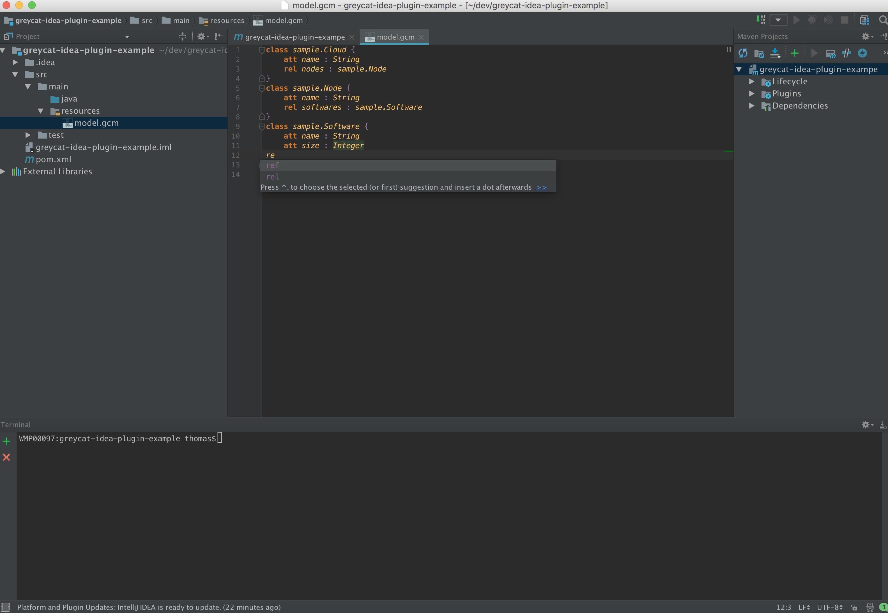

# GreyCat Editor
The most important features of the GreyCat Editor are:
- auto-completion for primitive types, classes, and enums 
- error checkers to verify correctness of your model while typing

[Figure 7: GreyCat Editor](id:fig-greycat-editor)
