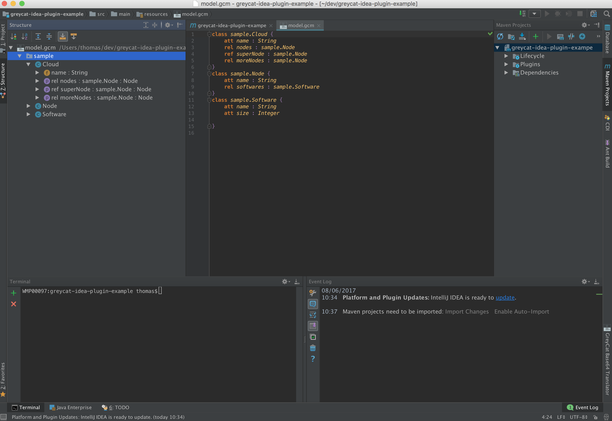

# Structure View

The Structure View provides a convenient quick access to classes, enums, and their properties.

Different Icons are used to differentiate:
- attributes
- references and relationships

The Structure View also allows to sort the elements by alphabetical order or by kind.

[Figure 8: Structure View](id:fig-structure-view)
